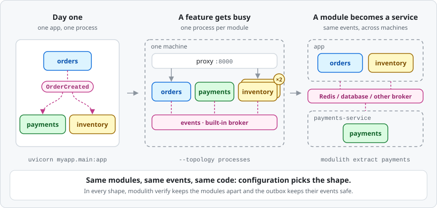
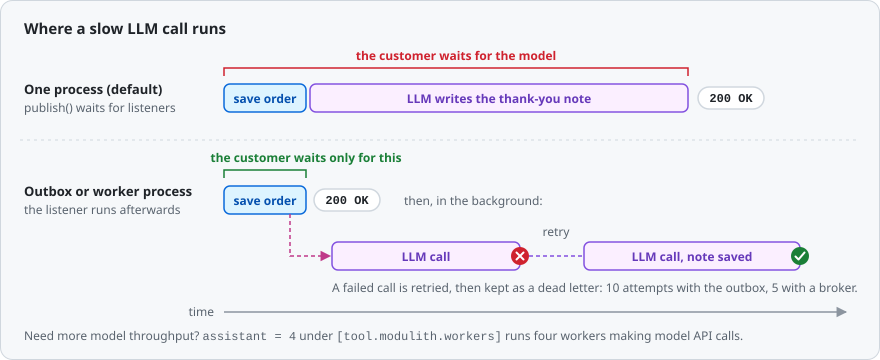
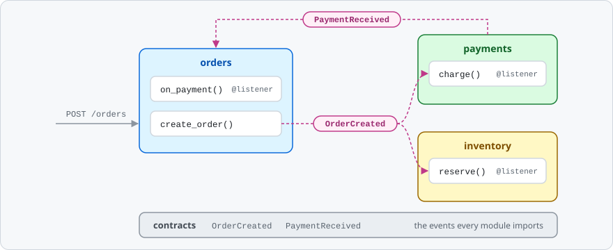
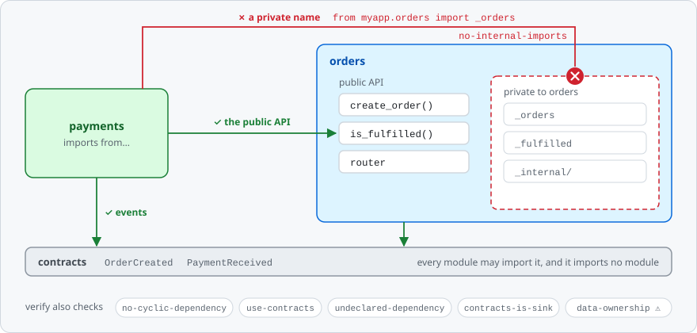

# modupy

[](https://github.com/jeansossmeier/modupy/actions?query=workflow%3ACI)
[](https://pypi.org/project/modupy/)
[](https://pypi.org/project/modupy/)
[](LICENSE)

**Start as one app. Grow into processes and services without re-architecting.**



modupy helps you build a Python backend as a **modular monolith**: one codebase, split into modules that talk through events and can't reach into each other's code.
On day one it is a plain FastAPI app.
As your company grows, the same code runs one process per module, scales the busy parts, keeps events safe in your database, and splits a module off into its own service.
Each step is a config change, a command or a few lines of wiring, never a rewrite.

```bash
pip install 'modupy[fastapi,cli]'
```

modupy installs the `modulith` package, so you `import modulith`, run the `modulith` command and configure `[tool.modulith]`.
`pip install modulith` installs an unrelated project.

[Quickstart](#quickstart) · [How it grows](#how-it-grows-with-your-company) · [Ready for AI](#ready-for-ai) · [Examples](#examples) · [Docs](#documentation)

> Pre-1.0 alpha: breaking changes can land in 0.x releases. See [Status](#status).

## Why modupy

Most backends end up in one of two painful places:

- **A big ball of mud.** One app where everything imports everything. It is quick to start, then every change breaks something far away, and splitting it up means a rewrite.
- **Microservices too early.** Network calls, a dozen deploy pipelines and a platform team, long before your traffic needs them.

modupy is the path in between:

- **Modules with walls.** Each module is a Python package with a public API. Names that start with `_` are private, and `modulith verify` fails your build when another module imports them.
- **Events instead of calls.** A module publishes `OrderCreated`, and every module that cares reacts to it. The publisher never needs to know who is listening.
- **One codebase, any shape.** The same modules run in one process, in one process per module, or as separate services. Config picks the shape.
- **No lost events.** With the outbox on, an event published inside your database transaction is saved with your data, then retried until it is delivered or set aside as a *dead letter* you can replay.

## How it grows with your company

| When your company… | You change… | You get… |
|---|---|---|
| ships its first version | nothing: `uvicorn myapp.main:app` | one process, zero infrastructure |
| adds engineers and teams | [`modulith verify`](#1-keep-modules-independent) in CI | boundaries nobody breaks by accident |
| can't afford to lose data | [`outbox = "postgres"`](#2-never-lose-an-event), your database URL and a session around each write | events saved with your data, retried, and kept as dead letters if they keep failing |
| sees one feature get busy | [`--topology processes`](#3-give-busy-modules-their-own-processes) plus a worker count | one process per module, and more of them for the busy one |
| outgrows one server | [`broker = "redis-streams"`](#4-spread-across-machines) | events that travel between machines |
| gives a team its own service | [`modulith extract <module>`](#5-split-off-a-service) | a standalone service built from one module |

Your events and listeners never change.
The only code you add is a few lines of session wiring for the outbox, and your URLs stay the same as long as `main.py` mounts each module's `router` at `/<module>`, as the quickstart does.

## Ready for AI

### Call an LLM without slowing down your API

Model calls are slow, rate-limited and sometimes fail.
Give them their own module and trigger them with an event:

```python
# myapp/assistant/__init__.py, a new module that nothing else imports
from modulith import listener

from myapp.contracts.events import OrderCreated


@listener
async def write_thank_you_note(event: OrderCreated) -> None:
    note = await llm.generate(f"Write a two-line thank-you note for order {event.order_id}")
    await notes.save(event.order_id, note)  # llm and notes: your model client and your storage
```



Then choose how it runs. The listener does not change:

- **With the outbox on** and the order published inside its database session ([step 2](#2-never-lose-an-event)), the note is written after the order commits, in the background, so placing an order stays fast. A failed model call is retried with backoff, up to 10 attempts by default, then kept as a dead letter. `modulith outbox dead-letter --retry-all` replays it by running the listener inside that command, so run it where your model credentials are.
- **In its own processes** ([step 3](#3-give-busy-modules-their-own-processes)), a slow model cannot hold up your API, and `assistant = 4` under `[tool.modulith.workers]` gives the assistant four of them. There the broker retries a failed call instead, 5 times by default, and keeps its dead letters itself.
- **As its own service** ([step 5](#5-split-off-a-service)), `modulith extract assistant` gives it its own deploys, scaling and model API keys, or hands it to another team, while the rest of the app keeps publishing the same events.

In the default single process, `publish()` waits for every listener and re-raises the first error, so a slow or failing model call slows down or fails the order request.
With the outbox or a broker, events are delivered at least once, so make listeners safe to run twice, for example by skipping an order that already has a note.

### Keep AI coding assistants inside the lines

Coding assistants write code fast, and they import whatever makes it work.
Say one fixes a bug in `payments` by adding `from myapp.orders import _orders`:

```bash
$ modulith verify

payments:
  [ERROR] no-internal-imports: payments imports _orders from orders, reaching into orders's private package. Cross-module access must go through orders's public API.  (myapp/payments/__init__.py:1)

1 error(s), 0 warning(s)
```

It exits with code 1, so CI fails.
Add it to your agent's instructions (`AGENTS.md`, `CLAUDE.md`) and the agent can catch the mistake before you see it.
Small modules with a public API also keep the context an assistant needs small, and `modulith docs` draws Mermaid diagrams of how your modules connect.

## The 30-second pitch

Three modules and one shared contract.
`orders` publishes an event, `payments` and `inventory` react to it, and no module imports another.
An event is any class marked `@event`; a frozen dataclass is the recommended shape.



```python
# myapp/contracts/events.py
from dataclasses import dataclass

from modulith import event


@event
@dataclass(frozen=True)
class OrderCreated:
    order_id: str


@event
@dataclass(frozen=True)
class PaymentReceived:
    order_id: str
```

```python
# myapp/orders/__init__.py
from modulith import listener, publish

from myapp.contracts.events import OrderCreated, PaymentReceived

_orders: dict[str, str] = {}  # order_id -> customer_id
_fulfilled: set[str] = set()


async def create_order(customer_id: str) -> str:
    order_id = f"ord-{len(_orders) + 1}"
    _orders[order_id] = customer_id  # your real persistence goes here
    await publish(OrderCreated(order_id=order_id))
    return order_id


def is_fulfilled(order_id: str) -> bool:
    return order_id in _fulfilled


@listener
async def on_payment(event: PaymentReceived) -> None:
    """Cross-module communication via events, not direct calls."""
    _fulfilled.add(event.order_id)  # your real fulfilment goes here


# Re-export the router onto the module package. Process-per-module mode serves
# HTTP by mounting each module package's `router` attribute under /<module>.
from myapp.orders.api import router as router  # noqa: E402
```

```python
# myapp/payments/__init__.py
from modulith import listener, publish

from myapp.contracts.events import OrderCreated, PaymentReceived


@listener
async def charge(event: OrderCreated) -> None:
    await publish(PaymentReceived(order_id=event.order_id))  # your real charge goes here
```

<details>
<summary>The other three files: the orders routes, the inventory module and the app</summary>

```python
# myapp/orders/api.py
from fastapi import APIRouter, HTTPException
from pydantic import BaseModel

from myapp.orders import create_order, is_fulfilled

router = APIRouter()


class NewOrder(BaseModel):
    customer_id: str


@router.post("")
async def post_order(body: NewOrder) -> dict[str, str]:
    return {"order_id": await create_order(body.customer_id)}


@router.get("/{order_id}/fulfilment")
async def get_fulfilment(order_id: str) -> dict[str, str | bool]:
    if not is_fulfilled(order_id):
        raise HTTPException(status_code=404, detail="order not fulfilled")
    return {"order_id": order_id, "fulfilled": True}
```

```python
# myapp/inventory/__init__.py
from fastapi import APIRouter, HTTPException
from modulith import listener

from myapp.contracts.events import OrderCreated

_reserved: set[str] = set()

router = APIRouter()


@listener
async def reserve(event: OrderCreated) -> None:
    _reserved.add(event.order_id)  # your real stock reservation goes here


@router.get("/{order_id}")
async def get_reservation(order_id: str) -> dict[str, str | bool]:
    if order_id not in _reserved:
        raise HTTPException(status_code=404, detail="order not reserved")
    return {"order_id": order_id, "reserved": True}
```

```python
# myapp/main.py
import logging

from fastapi import FastAPI

from myapp.inventory import router as inventory_router
from myapp.orders import router as orders_router

logging.basicConfig(level=logging.INFO)  # so the banner below is visible

app = FastAPI()
app.include_router(orders_router, prefix="/orders")
app.include_router(inventory_router, prefix="/inventory")

# That's it. Modules auto-discovered. Listeners auto-registered.
```

</details>

Run it:

```bash
$ uvicorn myapp.main:app
INFO:     Uvicorn running on http://127.0.0.1:8000 (Press CTRL+C to quit)
INFO:modulith:detected application package 'myapp'
INFO:modulith:discovered 4 module(s): contracts, inventory, orders, payments
INFO:modulith:outbox=memory, broker=memory, topology=single
INFO:modulith:outbox disabled — set [tool.modulith].outbox = 'postgres' for durable event delivery
INFO:modulith:ready
```

modupy starts lazily, so its log lines appear on the first `publish()`: the order below.

```bash
$ curl -sX POST localhost:8000/orders \
      -H 'content-type: application/json' -d '{"customer_id": "alice"}'
{"order_id":"ord-1"}
```

The order fanned out through events: `payments` charged it and published `PaymentReceived`, which marked it fulfilled, while `inventory` reserved the stock.

```bash
$ curl -s localhost:8000/orders/ord-1/fulfilment
{"order_id":"ord-1","fulfilled":true}
$ curl -s localhost:8000/inventory/ord-1
{"order_id":"ord-1","reserved":true}
```

## Quickstart

### Install

```bash
pip install 'modupy[fastapi,cli]'
```

`fastapi` brings FastAPI and uvicorn, and `cli` adds the `modulith` command.
The other extras are `postgres` (the durable outbox), `redis` and `database` (brokers for more than one machine), `otel` (tracing), `test` (what the pytest fixtures use) and `all`.
The core alone, `pip install modupy`, has one dependency: `pluggy`.

> The outbox wiring in [step 2](#2-never-lose-an-event) (`bind_session`, `modulith migrate` and the retry settings) arrives in the first release after 0.10.0. Until then, install from this repository: `pip install 'modupy[fastapi,cli] @ git+https://github.com/jeansossmeier/modupy'`.

### Lay out your project

```text
myproject/
├── pyproject.toml          # names your package: [project] name = "myapp"
└── myapp/
    ├── __init__.py
    ├── contracts/          # the events that modules share
    │   ├── __init__.py
    │   └── events.py
    ├── orders/             # a module: a package with a public API
    │   ├── __init__.py     # public functions, plus `router` re-exported from api.py
    │   ├── _internal/      # private: other modules may not import it
    │   ├── api.py          # FastAPI routes
    │   └── handlers.py     # @listener functions, imported by __init__.py
    ├── inventory/
    │   └── __init__.py
    ├── payments/
    │   └── __init__.py
    └── main.py             # the FastAPI app
```

Three rules keep this working:

- Every module is a package with an `__init__.py`, and its `@listener` functions must be imported from there (for example `from . import handlers`) so they register.
- Names that start with `_` are private to their module.
- A module with routes re-exports its `router` from `__init__.py`, because a module running in its own process serves exactly that `router` under `/<module>`. A listener-only module like `payments` needs none.

The CLI finds your package through `pyproject.toml`, and one pytest setting lets your tests import it:

```toml
[project]
name = "myapp"
version = "0.1.0"

[tool.pytest.ini_options]
pythonpath = ["."]
```

### Run it

```bash
uvicorn myapp.main:app --reload
```

Check the boundaries:

```bash
$ modulith verify
✓ no boundary violations
```

### Run the same code, one process per module

```bash
$ modulith run myapp.main:app --topology=processes
modulith → process-per-module: 3 worker(s) [inventory:9001, orders:9002, payments:9003], reverse proxy on http://0.0.0.0:8000
```


Each module now runs in its own process behind one public port, so the URLs do not change:

```bash
$ curl -sX POST localhost:8000/orders \
      -H 'content-type: application/json' -d '{"customer_id": "alice"}'
{"order_id":"ord-1"}
```

Events now cross process boundaries, so give the order a moment: until `payments` has charged it, the fulfilment route answers 404.

```bash
$ curl -s localhost:8000/orders/ord-1/fulfilment
{"order_id":"ord-1","fulfilled":true}
$ curl -s localhost:8000/inventory/ord-1
{"order_id":"ord-1","reserved":true}
```

`contracts` only defines events, so it gets no process of its own.
The warnings at startup are about the default broker's production settings, which [step 3](#3-give-busy-modules-their-own-processes) covers.

### Test it

modupy's pytest fixtures run a whole event flow in one process, with no server:

```python
from modulith.testing import Scenario


def test_an_order_gets_paid(scenario: Scenario) -> None:
    from myapp.contracts.events import PaymentReceived
    from myapp.orders import create_order

    payment = scenario.call(create_order, "alice").expect_event(PaymentReceived).within(seconds=2)

    assert payment.order_id == "ord-1"
```

Save it under `tests/`; the imports sit inside the test because each test gets a fresh copy of your modules.

```bash
pip install pytest httpx2
pytest
```

## Grow it, step by step

### 1. Keep modules independent

A module may call another module's public functions and use the events in `contracts`; `modulith verify` refuses the rest:



Put the boundary check in CI, so nobody, human or AI, quietly couples two modules:

```yaml
# .github/workflows/ci.yml, in the job that installs your app's dependencies
- run: pip install 'modupy[cli]'
- run: modulith verify
```

As teams take ownership, give each module a manifest.
modupy checks it when it boots, and `verify` uses it to police dependencies and table ownership:

```python
# myapp/orders/_manifest.py, optional
from modulith import declare_module

declare_module(
    publishes=["OrderCreated"],
    owns_tables=["orders_order"],
    declared_dependencies=["contracts"],
)
```

Set `strict_boundaries = true` and modupy refuses to boot on any boundary violation, warnings included.
`verify` and `--topology processes` then fail before anything starts; in a single process, call `bootstrap()` at startup ([step 2](#2-never-lose-an-event) shows where) to fail there rather than at the first `publish()`.
Single-process `modulith dev` only warns, so a violation never stops your dev server.

### 2. Never lose an event

The outbox writes each event you publish inside a database session into the same transaction as your data.
If the transaction rolls back, the event is gone too; if the process crashes after the commit, the event is still there and is delivered after the app restarts.
A `publish()` outside a session is delivered directly and saves nothing, so the session wiring below is required.


```bash
pip install 'modupy[postgres]'   # for MySQL or SQLite, use 'modupy[database]'
```

```toml
[tool.modulith]
outbox = "postgres"                              # the SQL outbox: Postgres, MySQL or SQLite
outbox_url = "postgresql+asyncpg://app@db/app"   # your business database, or MODULITH_OUTBOX_URL
```

```bash
modulith migrate   # creates the outbox tables in that database
```

Publish inside your transaction:

```python
# in myapp/orders/__init__.py
from uuid import uuid4

from modulith import publish
from modulith.builtin.outbox import bind_session, unbind_session

from myapp.contracts.events import OrderCreated


async def create_order(customer_id: str) -> str:
    order_id = str(uuid4())
    async with sessionmaker() as session:  # your SQLAlchemy async sessionmaker
        token = bind_session(session)
        try:
            session.add(Order(id=order_id, customer_id=customer_id))  # your model
            await publish(OrderCreated(order_id=order_id))
            await session.commit()  # the order and its event are saved together
        finally:
            unbind_session(token)
    return order_id
```

And start the outbox with your app:

```python
# in myapp/main.py
from contextlib import asynccontextmanager

from fastapi import FastAPI
from modulith import bootstrap
from modulith.builtin import outbox


@asynccontextmanager
async def lifespan(app: FastAPI):
    bootstrap()
    outbox.start()  # also redelivers what a crashed process left undelivered
    yield
    await outbox.shutdown()


app = FastAPI(lifespan=lifespan)
```

Watch delivery, and fix it when a listener keeps failing:

```bash
modulith outbox status                    # incomplete, completed and dead-lettered counts
modulith outbox dead-letter --retry-all   # replay the events whose listeners gave up
```

Retries are tuned under `[tool.modulith.outbox_options]`.
[`examples/demo_app`](examples/demo_app) runs all of this on SQLite, then on Postgres.

### 3. Give busy modules their own processes

One flag runs every module in its own process, behind one public port:

```bash
modulith run myapp.main:app --topology processes
```

Give a busy module more processes:

```toml
[tool.modulith.workers]
reports = 4   # every other module keeps the default of 1
```

Each process has its own memory and the proxy spreads requests across them, so keep that module's state in your database.
A supervisor restarts a crashed worker after 1, 2, 4, 8, then 16 seconds, and gives up after six crashes in a row, leaving that module down until you fix it.
Events between processes travel through a built-in queue on the same machine, so there is still nothing extra to install; in production, set its `state_dir` under `[tool.modulith.broker_options]` ([DEPLOYMENT.md](docs/DEPLOYMENT.md#process-per-module-topology)).

### 4. Spread across machines

Swap the broker, and events travel between hosts:

```toml
[tool.modulith]
topology = "processes"
broker = "redis-streams"   # reads REDIS_URL; pip install 'modupy[redis]'
```

Rather not run Redis?
`broker = "database"` puts the queue in Postgres or MySQL instead: install `modupy[database]` and set `url` under `[tool.modulith.broker_options]` ([Cookbook](docs/COOKBOOK.md#use-a-shared-database-broker)).
Delivery is at least once, so listeners must be safe to run twice.
Then place modules on different machines: `modulith k8s-manifest` ([step 6](#6-run-it-in-production)) writes one Deployment per module, or start a single module anywhere with `MODULITH_MODULE=reports MODULITH_APP_PACKAGE=myapp uvicorn modulith._worker:create_app --factory`.

### 5. Split off a service

When a module needs its own deploys, its own team or its own hardware, extract it:

```bash
modulith extract payments --output payments-service
cd payments-service
cp .env.example .env   # then fill in your broker and database settings
docker build -t payments-service .
docker run --env-file .env -p 8000:8000 payments-service
```

This builds on step 4: the rest of the app must run with `topology = "processes"` and a shared broker, which `extract` also reads to pick the service's drivers.
The service gets the module, its contracts, a `pyproject.toml`, a `Dockerfile`, a `README.md` and a `.env.example`.
The rest of the app keeps publishing the same events through the broker, and the new service consumes them. Then delete the module from the main app, because while both run they split its events.
`extract` refuses a module that still reaches into other modules or shares their tables, so the check from step 1 is what makes splitting safe.

### 6. Run it in production

```bash
modulith k8s-manifest --image myapp:1.0.0   # a Deployment and a Service per module, plus one Ingress
modulith openapi --output openapi.json      # one OpenAPI spec covering every module
modulith doctor                             # architecture and operations health checks
```

`k8s-manifest` needs the shared broker from [step 4](#4-spread-across-machines).
Install `modupy[otel]` and configure an OpenTelemetry tracer provider, and every publish and every listener call gets a span.

## Already have a codebase?

Adopt modupy one module at a time:

```bash
modulith audit                      # proposes modules and writes MIGRATION.md with a readiness score
modulith verify --update-baseline   # accepts today's violations; commit .modulith-baseline.json
modulith verify --mode=ratchet      # from now on, fails only on new violations
```

Keep `strict_boundaries` off while you adopt: with it on, `verify` fails at boot on the very violations the baseline should record.
[MIGRATION_GUIDE.md](MIGRATION_GUIDE.md) walks through the whole move.

## Configuration

Everything lives in `pyproject.toml`, and the defaults need no changes to get started:

```toml
[tool.modulith]
package = "myapp"                                # default: [project].name
outbox = "postgres"                              # default: "memory"
outbox_url = "postgresql+asyncpg://app@db/app"
topology = "processes"                           # default: "single"
broker = "redis-streams"                         # with processes, default "shm" ("database" if a broker url is set)
strict_boundaries = true                         # refuse to boot on any boundary violation

[tool.modulith.workers]
default = 1
reports = 4
```

Every setting directly under `[tool.modulith]` can also come from an environment variable, such as `MODULITH_OUTBOX_URL` or `MODULITH_BROKER`.
[API_REFERENCE.md](docs/API_REFERENCE.md#configuration) lists every setting and its default, [ARCHITECTURE.md](docs/ARCHITECTURE.md) explains how settings resolve (§3), outbox retries (§7) and brokers (§8), and [DEPLOYMENT.md](docs/DEPLOYMENT.md#actuator-access-_modulith) covers securing the actuator endpoints.

## CLI

| Command | What it does | When you use it |
|---|---|---|
| `modulith dev myapp.main:app` | runs with auto-reload and prints boundary warnings at startup | local development |
| `modulith run myapp.main:app` | runs for production; add `--topology processes` for one process per module | deploying |
| `modulith verify` | checks module boundaries and exits 1 on a violation | CI, and AI agents |
| `modulith info` | shows the detected package, modules and settings | finding your way |
| `modulith docs` | writes Mermaid diagrams of your modules to `docs/modulith` | onboarding |
| `modulith doctor` | reports architecture and operations health | reviews and incidents |
| `modulith migrate` | creates the outbox and database-broker tables | deploying |
| `modulith outbox status` | counts incomplete, completed and dead-lettered events | operations |
| `modulith outbox dead-letter` | lists dead-lettered events, or replays them with `--retry-all` | incidents |
| `modulith broker dead-letter` | lists dead-lettered broker deliveries, or resubmits them with `--retry-all` (database broker only) | incidents |
| `modulith broker drop-group <group>` | removes a retired module's consumer group | operations |
| `modulith extract <module>` | turns one module into a standalone service | splitting a service off |
| `modulith k8s-manifest` | writes Kubernetes manifests, one Deployment per module | deploying |
| `modulith openapi` | merges every module's API into one OpenAPI file | API portals and clients |
| `modulith audit` | assesses an existing codebase and writes `MIGRATION.md` | adopting modupy |

Commands that inspect your modules find your package through `[tool.modulith].package`, else `[project].name`.
`disabled_rules = ["use-contracts"]` under `[tool.modulith.verify]` turns off boundary rules by their rule name, whether a built-in rule or one a plugin contributes, in `verify`, `doctor` and the `strict_boundaries` startup check; `parse-error` cannot be turned off.
Every command except `audit` and `migrate` imports your modules, `verify` included, so run them only on code you trust and where your app's dependencies are installed.
`modulith dev` and `modulith run` take `--log-level` (default `info`) for the supervisor and every worker; in one process they hand over to uvicorn, so modupy's startup banner shows only if your app configures logging, as `myapp/main.py` does.
With `strict_boundaries = true`, `verify`, `run --topology processes` and `dev --topology=processes` fail on warnings too; a single-process `run` fails when the app first boots modupy, and single-process `modulith dev` stays warn-only by design.
Exit codes: 0 for success, 1 for violations or bad input, 2 for an internal error or a CLI usage error.

## Examples

CI runs every command in every example's README exactly as written, from a fresh install of the built package.

| Example | Size | What it shows |
|---|---|---|
| [`quickstart`](examples/quickstart) | small: 3 modules | the code above, in one process and in one process per module |
| [`demo_app`](examples/demo_app) | mid: a shop with a database | the durable outbox on SQLite, `modulith migrate`, a scaled module, then Postgres and Redis |
| [`marketplace`](examples/marketplace) | large: 7 modules | a payment saga that undoes itself on failure, dead-letter recovery, a team boundary rule shipped as a plugin, tracing, Kubernetes and extracting a service |

Single-file plugin examples: [a verifier rule](examples/naming_convention_verifier.py), [a Redis Streams broker](examples/redis_streams_broker.py) and [a storage serializer](examples/versioned_json_serializer.py).

## Is modupy right for you?

It fits teams of roughly 3 to 15 engineers building a Python product, often B2B SaaS, who want to put off microservices for as long as possible without painting themselves into a corner.
If that is not you, it may not be the right fit; [SPEC.md](SPEC.md) Part II explains who it is for.

| | modupy | FastAPI + folders | FastAPI + Celery + import-linter | Microservices |
|---|---|---|---|---|
| Module boundaries | ✓ enforced | ✗ convention only | ✓ enforced by import-linter | ✓ enforced by the network |
| Events between modules | ✓ in-process or through a broker | ✗ do it yourself | ✓ Celery | ✓ broker only |
| Transactional outbox | ✓ built in | ✗ do it yourself | ✗ do it yourself | ✗ do it yourself, per service |
| One process per module | ✓ one flag | ✗ | ✗ Celery workers split by task queue, not by module | n/a, already separate |
| Split a module into a service | ✓ `modulith extract` | ✗ by hand | ✗ by hand | n/a, already separate |
| Adopting on an existing codebase | ✓ baseline and ratchet | n/a | ✓ | ✗ a rewrite |
| Operational complexity | low | lowest | medium | highest |

modupy is inspired by [Spring Modulith](https://spring.io/projects/spring-modulith).

## Status

modupy is a **pre-1.0 alpha**: breaking changes may land in 0.x minor releases, and each one is listed in [CHANGELOG.md](CHANGELOG.md).
The core, the transactional outbox, the tooling and the process-per-module runtime are code-complete and pass `pytest`, `mypy --strict` and `ruff`; more adapters follow after 1.0, as users ask for them ([ROADMAP.md](ROADMAP.md)).
Every pull request and every push to `main` runs ~2,380 hermetic tests on Python 3.11, 3.12 and 3.13 (Linux, with the SHM broker also on macOS and Windows), plus 116 integration tests against real Postgres, MySQL and Redis containers, which include every example README run from the built wheel.
[STABILITY.md](docs/STABILITY.md) states what stays stable across 0.x releases.

## Documentation

- [SPEC.md](SPEC.md): the full specification and every design decision
- [docs/ARCHITECTURE.md](docs/ARCHITECTURE.md): how modupy works inside, from the runtime and plugins to the outbox, cross-process delivery and the verifier
- [docs/COOKBOOK.md](docs/COOKBOOK.md): step-by-step recipes for common jobs
- [docs/DEPLOYMENT.md](docs/DEPLOYMENT.md): Docker and Kubernetes, scaling, health probes and operations
- [docs/API_REFERENCE.md](docs/API_REFERENCE.md): the public API, generated from docstrings
- [docs/STABILITY.md](docs/STABILITY.md): what is guaranteed across 0.x releases
- [MIGRATION_GUIDE.md](MIGRATION_GUIDE.md): adopting modupy in an existing codebase
- [ROADMAP.md](ROADMAP.md): what comes next
- [CHANGELOG.md](CHANGELOG.md): what changed in each release

## Contributing

The design is opinionated, so please read [SPEC.md](SPEC.md) before opening a large PR.
The plugin contract (13 hookspecs, 5 protocols) is the most stable part of the project: additions are easy, and signature changes need strong justification.
Development setup and both test suites, the hermetic default and the Docker-backed integration suite, are in [CONTRIBUTING.md](CONTRIBUTING.md).

## License

Copyright 2026 Jean Sossmeier. Apache-2.0, see [LICENSE](LICENSE).
