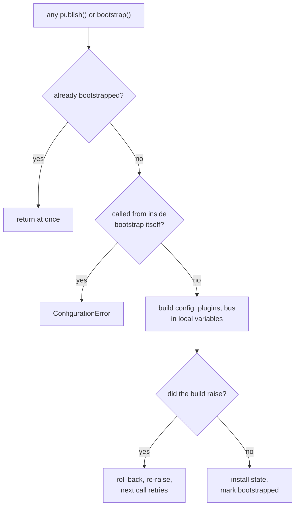
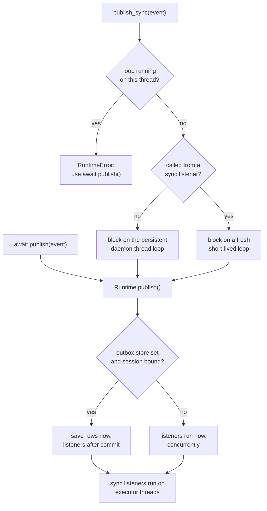
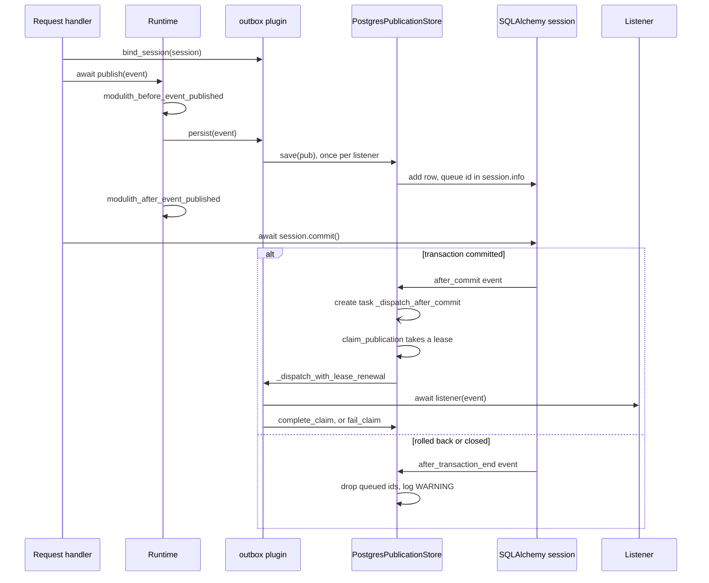
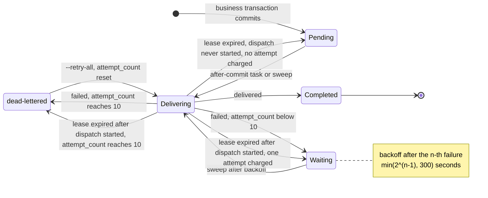
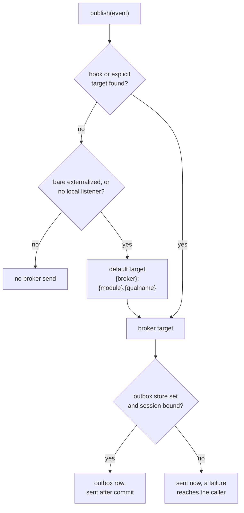
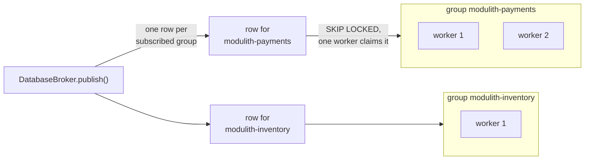

# modupy Architecture Guide

How modupy works internally — the runtime, the plugin contract, the
transactional outbox, cross-process delivery, and the boundary verifier. This
is the "how it fits together" companion to the reference material:

- **[SPEC.md](../SPEC.md)** is the design document: the reasoning behind
  modupy's design. Where it and the code disagree, the code and
  [STABILITY.md](STABILITY.md) are right. Every section here points back to the
  relevant SPEC part for the reasoning.
- **[API_REFERENCE.md](API_REFERENCE.md)** is the generated reference for the
  public surface (`modulith.__all__`).
- **[COOKBOOK.md](COOKBOOK.md)** is task-oriented recipes.

If you only want to *use* modupy, start with the [README](../README.md) and
the [demo app](../examples/demo_app). Read this guide when you want to know why
the framework behaves the way it does, or you're writing a plugin/adapter.
modupy installs the `modulith` package, so you `import modulith` and run
`modulith`.

---

## 1. The core idea: one codebase, three deployment tiers

modupy is built around a single promise (SPEC §1.2): your module code —
`@event`, `@listener`, `publish()` — does not change as you move through three
runtime tiers. Only configuration does.

| Tier | `topology` / `outbox` | What runs | When |
|---|---|---|---|
| **In-process** | `single`, `outbox=memory` | one process, in-memory event bus | dev, small apps |
| **Durable in-process** | `single`, `outbox=postgres` | one process, events survive crashes via the outbox | production single-process |
| **Process-per-module** | `processes` (defaults to `shm`) | one subprocess per module behind a reverse proxy, events routed through the broker | when a module needs its own resource budget |

The whole architecture exists to make that promise true: the same `publish()`
call dispatches in-memory, or writes to a durable outbox, or fans out across
processes through a broker — decided entirely by configuration at bootstrap.

---

## 2. The runtime singleton and lazy bootstrap

**SPEC §6.1–6.2.** There is exactly one runtime per process: the module-global
`_runtime` in `modulith/runtime.py`. The public API in `modulith/decorators.py`
(`event`, `listener`, `publish`, `configure`) and `modulith/sync.py`
(`publish_sync`) are thin wrappers over it.

The runtime **bootstraps lazily** — it initializes on first use (the first
`publish()` or `publish_sync()`), not at import or process start. This is why
the startup banner in a uvicorn app appears after uvicorn's own lines, on the
first request that publishes an event, rather than at process launch (README
"30-second pitch").

Bootstrap builds everything in local variables first, so a failure while building leaves the runtime untouched and the next call tries again:

Bootstrap assembles the whole system in one shot:

1. `load_configuration()` resolves the effective config (§3).
2. `detect_application_package()` finds the app's root package (§4).
3. `create_plugin_manager()` wires pluggy and loads built-in + entry-point
   plugins (§5).
4. The `modulith_discover_modules` hook walks the package for modules; each
   module package (and its `_manifest.py`) is imported.
5. Queued listeners are flushed onto the new `InMemoryEventBus`.
6. If `verify_manifests` is on, `verify_manifest()` checks each declared
   manifest against reality (§9).

### Registration timing

`listener` registration works **before, during, and after** bootstrap. Before
bootstrap the runtime queues the listener and flushes it when the bus is
created; after bootstrap it registers directly. In a single process the
listener is wired correctly either way — the decorator never has to care
whether bootstrap has happened yet.

A process-per-module worker is stricter. It builds its broker consumer once at
startup, and that subscription list and the serializer's allowed event types
come from the listeners registered by then. A listener registered after that
runs locally but is **local-only**: it receives only events published in its
own process, never broker deliveries, and the worker logs a WARNING naming it.
Register such a listener while its module is imported.

`configure()`, by contrast, is only legal **before** bootstrap. Once the
runtime is bootstrapped its configuration is frozen (the `Configuration`
dataclass is `frozen=True`) and `configure()` raises `ConfigurationError` —
mutating config after start would create inconsistent state.

---

## 3. Configuration resolution

**SPEC §6.3; `modulith/config.py`.** `load_configuration()` layers four sources,
highest priority first:

1. explicit keyword arguments to `configure()` / `load_configuration()`
2. `MODULITH_*` environment variables
3. the `[tool.modulith]` table in `pyproject.toml`
4. hard-coded defaults on the `Configuration` dataclass

Every setting has a sensible default, so an app with no `[tool.modulith]` and no
env vars runs. The design bias is *fail loud on misconfiguration* rather than
silently guess:

- **Unknown scalar keys raise**, listing the valid keys — a typo can't silently
  no-op.
- **Only scalar fields have env vars.** The table-valued fields
  (`outbox_options`, `broker_options`, `workers`) come from
  `[tool.modulith.*]` subtables only. An empty-string env var is treated as
  *unset* (templated deploys commonly render `MODULITH_X=""`), and booleans are
  parsed strictly (`1/true/yes` · `0/false/no`) — any other value raises rather
  than coercing garbage to `False`. Broker adapters additionally layer their
  own `MODULITH_BROKER_<KEY>` environment contract over `broker_options`.
- **Subtable spellings are policed.** `[tool.modulith.outbox_options]` is the
  *only* outbox-options subtable; a `[tool.modulith.outbox]` subtable raises,
  pointing at `outbox_options` (`outbox` is the scalar adapter name).
  `broker`/`broker_options` are aliases but colliding subtables raise; a typo of
  a real subtable raises with a "did you mean" hint. `[tool.modulith.verify]`
  supports `disabled_rules`, a list of boundary-rule names to turn off (a
  malformed value raises), and ignores any other key; genuinely-unknown
  subtables are dropped silently for forward-compatibility.
- **A `pyproject.toml` that fails to parse raises** — including the
  duplicate-key collision TOML throws when a key is written as both a scalar and
  a table. Silently skipping it would revert every setting (including
  `production = true`) to defaults with no warning.

**`[tool.modulith.outbox_options]`.** Config load validates these eight keys
whenever they are present. When the store is bound from `outbox_url` (a
durable outbox and no store bound yet), `Runtime.bind_configured_outbox`
forwards them to `outbox.configure()` in the same call that binds the store.
Bootstrap makes that call only while `auto_discover` is on (the default);
every process-topology worker makes it after importing its module.
The table gives each key's default, which is `configure()`'s own, and its
check:

| Key | Default | Accepted |
|---|---|---|
| `claim_strategy` | `"lease"` | `"lease"`, `"advisory_lock"`, `"none"` (§7.4) |
| `claim_lease_seconds` | `60` | finite number > 0, at most 86400 (one day) |
| `claim_batch_size` | `100` | integer > 0 |
| `dead_letter_after_attempts` | `10` | integer > 0 |
| `retry_interval_seconds` | `30` | finite number > 0 |
| `retry_stale_seconds` | `30` | finite number > 0 |
| `max_retry_backoff_seconds` | `300` | finite number > 0 |
| `completion_mode` | `"update"` | `"update"`, `"delete"`, `"archive"` (§7.3) |

A ninth key, `sqlite_wal`, is validated too but is not a `configure()`
setting: `bind_configured_outbox` applies it to the engine it builds, running
`PRAGMA journal_mode=WAL` on every new connection. It accepts `true` or `false`
(off by default, so a database file's journal mode is never changed unless
asked). It applies to SQLite only and is ignored for other databases, so one
pyproject can serve a SQLite development setup and a Postgres deployment.
DEPLOYMENT.md covers what WAL changes on disk.

Any other key in the table is accepted and ignored, so a `pyproject.toml`
written for a newer release still loads. An application that calls
`outbox.configure()` before bootstrap keeps its own store and settings:
`outbox_url` and these keys are then not applied.

Two cross-field safety checks run in `_validate()`:

- **`production` + defaulted memory outbox → error.** Starting production on the
  in-memory outbox would lose events on restart; you must set a durable outbox
  or explicitly opt into `outbox = "memory"`.
- **`topology = "processes"` chooses a durable broker.** With no broker or
  URL/DSN it defaults to local `shm`; a configured URL/DSN instead infers
  `database`. An explicit memory broker raises because it cannot carry events
  between processes. (`topology = "subinterpreters"` remains reserved.)

`Configuration.explicit_keys` records which keys the user set versus which took
a default; the safety checks key on it (e.g. "defaulted memory outbox" is
different from "explicitly chose memory").

---

## 4. Auto-discovery

**SPEC §6.4; `modulith/builtin/discovery.py`.** Discovery is itself a plugin —
the `modulith_discover_modules` hook (`firstresult=True`: the first plugin to
return a non-`None` list wins). The built-in implementation:

- detects the application package from the call stack / config,
- walks its immediate subpackages, treating each **non-underscore-prefixed**
  subpackage as a module (`_internal/` and friends are private),
- imports each module package so its `@listener`s register, and imports the
  module's optional `_manifest.py`.

Because discovery *imports* module packages, `@listener` functions must be
reachable from the module's `__init__.py` (e.g. `from . import handlers`) to be
registered at startup. Override the hook for custom layouts — namespace
packages, multi-root projects, filesystem manifests.

---

## 5. The plugin contract

**SPEC Part IV.** Everything modupy does beyond the bare event bus is a
plugin. There are three distinct extension mechanisms, chosen by shape (SPEC
§3.3):

### 5.1 Hookspecs (many plugins, results combined)

`modulith/hooks.py` declares **13 hookspecs** — the stable, versioned contract.
Adding a hook is fine; changing an existing signature breaks every published
plugin. Three shapes:

- **Aggregating** (default): every plugin runs, results concatenate into a list
  — `modulith_verify_module`, `modulith_render_documentation`.
- **`firstresult=True`**: plugins run until one returns non-`None`; that wins —
  `modulith_discover_modules`, `modulith_resolve_event_target`.
- **Side-effect** (return `None`): every plugin runs for effect —
  `modulith_after_module_load`, `modulith_before_event_published`,
  `modulith_after_event_published`, `modulith_on_publish_error`,
  `modulith_on_listener_dispatch`, `modulith_on_listener_complete`,
  `modulith_on_listener_error`, `modulith_register_brokers`,
  `modulith_register_consumers`.

Plugins implement a hook with `@hookimpl` (from `modulith.markers`) and are
discovered via the `modulith` entry-point group in their `pyproject.toml`.

### 5.2 Driver protocols (exactly one wins)

`modulith/protocols.py` defines the `runtime_checkable` driver contracts —
`PublicationStore`, `EventSerializer`, `Broker`, `Consumer` — plus
`HealthAwareConsumer`, the optional capability a consumer may add so worker
readiness checks can query it. Stores and
serializers are "one wins" drivers: exactly one is active per app, wired
**explicitly** at startup, in one of two ways:

- **Config binding.** With a durable `outbox` and an `outbox_url`, modupy
  builds a `PostgresPublicationStore` and the plain `JsonEventSerializer` and
  passes them, with the `outbox_options` tuning keys (§3), to
  `outbox.configure()` unless the application already bound a store. Bootstrap
  does this only while `auto_discover` is on; every process-topology worker
  does it after importing its module.
- **Explicit wiring.** The application calls
  `modulith.builtin.outbox.configure(store, serializer)` itself, with
  `PostgresPublicationStore` from `modulith.adapters.postgres_outbox` or its
  own store, before bootstrap. This is the path for a custom serializer or a
  custom store.

Either way a server calls `outbox.start()` from its ASGI startup, after
`modulith.bootstrap()`, because `configure()` at import time runs before the
event loop exists and the retry loop and crash sweep need it; it binds a
session around the transaction that publishes with `outbox.bind_session()` and
`outbox.unbind_session()`; and it calls `outbox.shutdown()` on the way out.
All of those, and `PostgresPublicationStore`, are the documented wiring surface
in [STABILITY.md](STABILITY.md), even though the module holding the store is
otherwise an adapter internal. There is no
entry-point auto-discovery for drivers — only hook plugins are discovered.
Adapters implement a protocol by **duck typing**; they don't need to subclass
it (`runtime_checkable` is there so apps can `isinstance`-check for
diagnostics).

Brokers are the exception: many can be active at once, routed by scheme (§8.2).
`Consumer` is the broker's cross-process consumer half — the process-per-module
worker runs one per module, built by a factory registered via
`modulith_register_consumers`. Like brokers, exactly one consumer adapter wins
per scheme; the redis-streams adapter registers both halves (§8.3), as does the
database adapter (§8.4), and the local durable SHM adapter (§8.5).

### 5.3 The plugin manager and the observe-shield

**`modulith/manager.py`.** `create_plugin_manager()` builds the pluggy
`PluginManager`, registers the hookspecs, loads the built-in plugins (honoring
the `disable` list) and entry-point plugins, and calls `pm.check_pending()` so a
misspelled hook *name* fails at startup rather than silently never firing.

The critical safety property here is the **observe-contract shield**. The
per-listener observe hooks (`on_listener_dispatch` / `_complete` / `_error`)
and `modulith_on_publish_error` are documented as observers that *never gate*
dispatch. The manager enforces this: exceptions raised by those hook
implementations are logged and swallowed.
A failing span exporter or a broken alerting plugin can therefore never mask a
listener's own outcome, and — crucially — can never kill the outbox retry loop:
an unshielded observer exception propagating out of the retry task would stall
delivery for every pending publication in the table, not just the one it hit.

---

## 6. Event dispatch: the paths a `publish()` takes

**`modulith/event_bus.py`, `modulith/runtime.py`, `modulith/sync.py`.** The
`InMemoryEventBus` is the default single-process bus: an async bus that keys
listeners by `type(event)` and dispatches to **all** listeners for that type
**concurrently**. One listener raising does not block the others.

Every entry point ends in `Runtime.publish()`, which picks the durable path only inside a bound session:

`Runtime.publish()` is the single funnel. Its sequence:

1. Fire `modulith_before_event_published` (validation/enrichment/audit at the
   boundary; raising here aborts the publish and rolls back an enclosing
   transaction).
2. Decide the path:
   - **Durable (outbox) path** — when the outbox plugin is active *and* a
     transaction session is bound to the current context: the event is
     persisted as `EventPublication` rows inside the business transaction and
     dispatched after commit (§7).
   - **In-memory path** — otherwise: dispatch directly to the bus now.
3. On success fire `modulith_after_event_published`. On a failure between the
   two publish hooks (outbox persist, event serialization, an inline broker
   route) fire `modulith_on_publish_error` instead and re-raise — the after
   hook is scoped to a successful publish, so the error hook is where a plugin
   closes the span it opened in step 1.
4. Wrap each listener invocation in the lifecycle hooks
   (`on_listener_dispatch` → listener → `on_listener_error` if it raised →
   `on_listener_complete` either way).
   On the in-memory path the listeners run inside step 2, so these hooks fire
   before the after hook, which fires even when a listener raised;
   `publish()` then re-raises the first listener error.
   On the durable path they fire after commit (§7.1).

On the in-memory path, which is every publish under the memory outbox, the
listeners run inside `publish()`, so they run while the publisher's transaction
is still open. On a SQLite file, a publisher that has already flushed a write
holds the file's write lock, and a listener that writes in its own transaction
waits on that lock until SQLite's busy timeout runs out. The listener then
fails with `database is locked`, and `publish()` re-raises the failure. Publish
before you flush, as `place_order` in the
[demo app](../examples/demo_app/shop/orders/__init__.py) does.

### The four contexts, one API

- **Async, no transaction** → in-memory concurrent dispatch.
- **Async, inside a bound session** → durable outbox path.
- **Sync code** → `publish_sync()` detects its context (SPEC §5.2): it refuses
  to run on a thread that already has a running loop (use `await publish`), runs
  nested sync-listener publishes on a fresh short-lived loop to avoid exhausting
  the shared executor, and otherwise dispatches on a persistent daemon-thread
  loop and blocks. A budget timeout (default 30s) protects against listener
  deadlocks and raises `PublishSyncTimeout` — a subclass of `TimeoutError` that
  is deliberately distinct from a `TimeoutError` raised *by* a listener, so the
  framework never swallows a genuine application failure as a budget overrun.
  That persistent daemon-thread loop is a second event loop.
  - **Bootstrap:** the first `publish_sync()` bootstraps the runtime on the
    calling thread, before it hands the event to that loop and outside its
    timeout, so package auto-detection sees the caller's module and a failing
    bootstrap raises from the call. Sync code has no running loop to start the
    durable outbox's retry loop on: with an outbox bound from `outbox_url`, the
    retry loop and its crash sweep start at the first publish made inside a
    bound session, as after `modulith.bootstrap()` from sync code.
  - **Outbox:** an outbox `AsyncEngine` also driven by `await publish()` on the
    app loop is shared across both loops. On Postgres and MySQL the first query
    one loop runs on a connection the other loop opened raises `RuntimeError:
    ... attached to a different loop`, even with idle connections in the pool;
    an asyncpg connection is then unusable from its own loop too. On SQLite,
    connections work from any loop, but once every pooled connection is
    checked out, a loop that waits for one after another loop already has
    raises `RuntimeError: <Queue> is bound to a different event loop`.
  - **Database broker:** the broker never shares its pool across loops. It
    submits a call from another loop to the loop that first used it and runs
    the call there, so that loop must stay running and unblocked.

  See [DEPLOYMENT.md](DEPLOYMENT.md): "Durable Single-Process (Outbox Pattern)"
  for the outbox and "A. SQLite Database Broker (Zero Infrastructure)" for the
  database broker.
- **Sync listeners** run in the event loop's default executor
  (`wrap_sync_listener`). Two sharp edges: only *synchronous* SQLAlchemy
  sessions work in an executor thread (an `AsyncSession` needs the greenlet
  bridge), and multiple sync listeners for one event run concurrently on
  separate threads with copies of the same context — share only thread-safe
  resources.

---

## 7. The transactional outbox

**SPEC Part VII; `modulith/builtin/outbox.py`,
`modulith/adapters/postgres_outbox.py`.** The outbox solves the dual-write
problem: an event published inside a DB transaction must be delivered **if and
only if** that transaction commits.

### 7.1 Save, then dispatch after commit

The calls for one publish inside a bound session, under the default `"lease"` claim strategy:

- `PublicationStore.save()` is called *inside* the business transaction, using
  the **same** session/connection. So the publication row commits atomically
  with the data that produced it — a rollback discards the event too (no ghost
  events), and a commit guarantees the event is durably recorded (no lost
  events).
- Dispatch happens **after commit**. The Postgres adapter registers a single
  SQLAlchemy `after_commit` listener that schedules delivery of the rows queued
  during that transaction. Broker routing is **commit-gated** for the same
  reason: inside a transaction `publish()` must not touch the broker, because a
  rollback can't un-send a message.

### 7.2 Retry loop, backoff, dead-lettering

**SPEC §7.4.** A publication row moves through these states under the default `"lease"` strategy.
The numbers are the defaults of `dead_letter_after_attempts` (10) and `max_retry_backoff_seconds` (300):

A background retry loop drives redelivery:

- Each sweep takes pending publications published at least `older_than` ago:
  through `claim_batch` under the default `"lease"` strategy, and through
  `find_incomplete` otherwise. On startup the sweep uses `older_than=0`
  (recover everything a crash left behind); steady-state it runs every
  `retry_interval_seconds` (30) and takes only rows at least
  `retry_stale_seconds` (30) old, so it doesn't thrash on freshly-published
  events.
- Start-up recovery is immediate: no grace period holds fresh rows back, so a
  new publication can wait behind a crashed process's backlog. Under the
  default `"lease"` strategy, `claim_batch` takes up to `claim_batch_size`
  rows with `older_than=0`, a row committed moments ago among them, and
  orders them by `coalesce(last_attempt_at, published_at)`, oldest first. It
  claims the whole batch before the sweep delivers its first row, and the
  sweep delivers the rows in that order. A publication committed just before
  the claim therefore sits behind the older rows of its batch, and its own
  after-commit delivery finds the row claimed and leaves it to the sweep. The
  cost is delay, not loss: the row waits for the delivery of the rows ahead of
  it. A row committed after the claim is claimed and delivered by its own
  after-commit task as usual.
- A row the crashed process was delivering under a lease (`claim_strategy=
  "lease"`, the default, which after-commit dispatch also takes) stays claimed
  until that lease expires: the startup sweep skips it, and the first sweep
  after expiry recovers it. In the normal case that is within
  `claim_lease_seconds` plus `retry_interval_seconds` of the crash. It takes
  longer when `retry_stale_seconds` exceeds the lease, because a periodic
  sweep only takes rows at least that old. It also takes longer while the
  previous sweep is still dispatching a slow batch, because the interval
  counts from the end of that sweep. And no sweep recovers anything while
  the runtime is not bootstrapped. A crash leaves leased the row being
  delivered and every row of its claimed batch the sweep had not reached
  yet, and those rows wait out the lease the same way. A graceful stop that
  cancels a sweep releases the row being delivered at once, and leaves only
  the unreached rows leased. Rows the sweep had already delivered, failed or
  released are not leased.
- A delivery cut off mid-listener counts as a failed attempt. The claim
  marks a row's dispatch as started (`dispatch_started`, migration `0007`)
  just before its listener runs, and the next claim of a lapsed row with
  that mark charges it one attempt, as if the listener had raised. A
  listener that keeps killing its process therefore backs off and
  dead-letters instead of being redelivered on every restart. Rows that
  only waited in a claimed batch, and rows a graceful stop released, come
  back uncharged. Under `"advisory_lock"` and `"none"` nothing records that
  a delivery started, so such a row is redelivered without limit there.
- Rows committed but not yet claimed, and rows under `"none"`, are recovered
  by the startup sweep.
- Under `"lease"`, a descendant forked from the process, such as a
  fork-started `multiprocessing` or `ProcessPoolExecutor` child, can also keep
  the dead process's row locks. A claim or completion transaction holds row
  locks until it commits. When the process dies inside one while a descendant
  still holds a copy of that connection's socket, the session stays idle in
  its open transaction, and every sweep skips those rows until the descendant
  exits or Postgres ends the session. `idle_in_transaction_session_timeout` on
  the outbox's role makes Postgres end it; DEPLOYMENT.md's
  [Postgres and PgBouncer settings for `advisory_lock`](DEPLOYMENT.md#postgres-and-pgbouncer-settings-for-advisory_lock)
  covers it.
- Under `"advisory_lock"` the row's lock lives as long as the dead process's
  Postgres session. When the process dies on a live host, its kernel closes
  the socket, the session ends, and the startup sweep recovers the row at
  once. Three cases keep the lock longer, and every sweep skips the row
  meanwhile:
  - A descendant forked from the process, such as a fork-started
    `multiprocessing` or `ProcessPoolExecutor` child: it keeps a copy of the
    lock connection's socket, so the session and its locks outlive the process
    for as long as that descendant lives. An orphaned `ProcessPoolExecutor`
    worker does not exit on its own, so it must be killed to free the locks.
    Start such children with the `spawn` or `forkserver` method
    (`multiprocessing.get_context("spawn")`, passed as `ProcessPoolExecutor`'s
    `mp_context`), which does not inherit the connection.
  - A host loss or a network partition: nothing closes the socket, so the row
    stays locked until Postgres drops the dead session through TCP keepalive.
    With stock Linux defaults that takes about 2 h 11 min: 7200 s idle, then 9
    probes 75 s apart.
  - A process that hangs without exiting keeps its session, and so its locks,
    until it resumes, or until it and every descendant forked from it have
    exited.
- Backoff is exponential, measured from `last_attempt_at` (not `published_at`),
  and **capped at 5 minutes** — a persistently-failing listener actually backs
  off instead of being retried every sweep.
- After **10 attempts** a publication is **dead-lettered** (surfaced via
  `modulith outbox status` and the doctor command) instead of retrying forever.
  Rows already over a lowered `dead_letter_after_attempts` are dead-lettered at
  the next sweep.
- The retry loop is exception-shielded end to end: an ack/observe/error-hook
  failure is logged, never allowed to kill the loop.

**Postgres session settings for `"advisory_lock"`.** Shortening the wait after a
host loss or a partition takes server keepalive settings, and running behind
PgBouncer takes session pooling and PgBouncer's own keepalive settings.
DEPLOYMENT.md's
[Postgres and PgBouncer settings for `advisory_lock`](DEPLOYMENT.md#postgres-and-pgbouncer-settings-for-advisory_lock)
lists them, with the URL, `connect_args` and `ALTER ROLE` forms.

### 7.3 Completion modes

**SPEC §7.3.** When a listener succeeds, `mark_complete()` runs. The
completion mode (set via `outbox.configure(completion_mode=...)` or
`outbox_options.completion_mode`) decides the
physical effect:

- `update` — flip `completed_at` in place (default; keeps an audit trail),
- `delete` — hard-delete the row (smallest table),
- `archive` — move it to `event_publications_archive` (audit trail without
  bloating the hot table; `purge` trims the archive past its retention).

### 7.4 The Postgres adapter

**SPEC §10.1.** `PostgresPublicationStore` is built on portable SQLAlchemy 2.0
Core/ORM with asyncpg, shipped in `modupy[postgres]` with packaged Alembic
revisions. Always migrate to `head` (`alembic upgrade head` against the
packaged `alembic.ini` — see [MIGRATION_GUIDE.md](../MIGRATION_GUIDE.md), the
outbox migration step): `0001_initial` alone is **not** enough for the shipped
default, because the lease columns (`claim_owner`, `claim_token`,
`claim_until`) arrive in `0003_outbox_claim_leases`, the claim/scan indexes
in `0005_outbox_scan_indexes`, `dispatch_started` in
`0007_outbox_dispatch_started`, and `trace_context` in
`0008_outbox_trace_context`. Against a schema missing any of those columns
the blast radius is not confined to delivery: `EventPublicationRow` maps
every one of them unconditionally, so `save()`'s
bound-session path enlists a row naming those columns in the caller's own
session, and the caller's business `commit()` — not just the sweep — fails
outright on the missing column. The sweep's own claim query fails the same
way and is exception-shielded (a transient store error must cost one sweep,
not the whole retry loop), so a process that only reads the outbox degrades
to "nothing is ever delivered" plus a repeating `outbox sweep failed`
traceback; but any publish inside a bound transaction aborts that write.

Timestamps are normalized to UTC-aware on write because SQLite (used by the
fast test suite against the same code path) loses tz. The default suite runs
this adapter against in-memory SQLite; the integration suite runs it against a
real `postgres:16` via testcontainers.

**Concurrent sweepers.** Two processes running the retry loop against one
outbox table are coordinated by `outbox.configure(claim_strategy=...)` or
`outbox_options.claim_strategy` (`modulith/_claims.py`); the shipped default
is `"lease"`:

| `claim_strategy` | How it coordinates | Cost |
|---|---|---|
| `"lease"` (default) | `claim_batch()` selects `FOR UPDATE SKIP LOCKED` on Postgres, writes `claim_owner`/`claim_token`/`claim_until` and **commits before dispatch**. On MySQL and SQLite it claims each selected row with a conditional `UPDATE` that re-checks `completed_at IS NULL AND (claim_until IS NULL OR claim_until <= now)`, and drops a row a concurrent sweeper claimed first. The lease renews at one third of `claim_lease_seconds` while dispatch is in flight, and completion/failure writes are fenced on `claim_token` so an expired claimant cannot clobber a newer one | Postgres: one extra write per claimed batch. MySQL/SQLite: one `UPDATE` statement per candidate row |
| `"advisory_lock"` | a per-publication `pg_try_advisory_lock` held for the duration of the dispatch. Postgres-only — a non-Postgres store rejects it at `configure()` | no extra write, but a held AUTOCOMMIT connection (no open transaction) per in-flight row. Lock connections come from a separate pool sized like the engine's, so held locks never starve the listener or the store's own reads of the engine pool. With a `QueuePool` (the async engine default) a process can therefore hold up to 2×(`pool_size` + `max_overflow`) Postgres connections during a burst, and keeps up to `pool_size` idle lock connections open after it. `NullPool`, `max_overflow=-1` and `pool_size=0` bound neither pool, so a burst opens one lock connection per in-flight row. The lock pool also caps how many rows the after-commit path delivers at once: an after-commit dispatch that waits past `pool_timeout` for a lock connection logs a WARNING and leaves its row, untouched and uncharged, to the sweep, which delivers one row at a time. A sweep that itself waits past `pool_timeout` logs a WARNING and leaves the rest of its batch to the next sweep. A lock connection returns to its pool when the lock attempt found the row taken or the unlock confirmed the release; after a failed lock query or unlock it is invalidated, so a lock never outlives its dispatch |
| `"advisory_lock"` | a per-publication `pg_try_advisory_lock` held for the duration of the dispatch. Postgres-only — a non-Postgres store, a store without `find_by_id`, or an engine on `StaticPool` or `SingletonThreadPool` (one shared connection) is rejected at `configure()` | no extra write, but a held AUTOCOMMIT connection (no open transaction) per in-flight row. Lock connections come from a separate pool sized like the engine's, so held locks never starve the listener or the store's own reads of the engine pool. With a `QueuePool` (the async engine default) a process can therefore hold up to 2×(`pool_size` + `max_overflow`) Postgres connections during a burst, and keeps up to `pool_size` idle lock connections open after it. `NullPool`, `max_overflow=-1` and `pool_size=0` bound neither pool, so a burst opens one lock connection per in-flight row. The lock pool also caps how many rows the after-commit path delivers at once: an after-commit dispatch that waits past `pool_timeout` for a lock connection logs a WARNING and leaves its row, untouched and uncharged, to the sweep, which delivers one row at a time. A sweep that itself waits past `pool_timeout` logs a WARNING and leaves the rest of its batch to the next sweep. A lock connection returns to its pool when the lock attempt found the row taken or the unlock confirmed the release; after a failed lock query or unlock it is invalidated, so a lock never outlives its dispatch |
| `"none"` | no coordination; two sweepers CAN dispatch the same row. Logged as a warning at `configure()` so the tradeoff is visible | none |

Tuning knobs: `claim_lease_seconds` (default 60 — the lease renews every
third of it while a listener runs, so it must exceed the longest event-loop
stall, not your slowest listener; a lease that lapses lets a peer legitimately
reclaim the row; it also bounds how long a crashed process's in-flight rows
wait for recovery, see §7.2) and `claim_batch_size` (default 100 rows per claim). A
renewal that raises (a database blip) is logged and retried until the lease
expires; it never fails the delivery. `outbox.configure()` and
`outbox_options` reject a `claim_lease_seconds` above 86400 (one day): no
delivery needs a longer lease, and an enormous one overflows the clock
arithmetic of every claim. Any positive value up to that is accepted.

**Replica clocks.** The outbox keeps time with each replica's own clock, where
the database broker uses the database server's (§8.4). `claim_batch()`,
`claim_publication()` and `renew_claim()` stamp `claim_until` from the claiming
process's `datetime.now(UTC)`, and the next claimant compares it with its own
clock. `last_attempt_at` is stamped by the process whose delivery failed, and
the sweeping process compares it with its own clock to apply the backoff. Keep
the clocks of replicas that share an outbox table within about a second of each
other, by running NTP or chrony on every host. With more skew, the replica
whose clock runs ahead re-dispatches early: it reads a peer's lease as expired,
and a failed row's backoff as elapsed, sooner by the skew, so with 1 s of skew
the first retry's 1 s backoff is over at once. A clock that runs behind only
delays a recovery or a retry.

Note what `FOR UPDATE SKIP LOCKED` does and does not buy on its own: under
`"none"` and `"advisory_lock"` the row locks taken by the sweep query are
released when that query's transaction ends, *before* dispatch begins, so they
do not partition work across processes. Only `claim_batch()` — which locks (or,
off Postgres, conditionally updates) and writes the claim in one transaction —
does. Either way delivery stays
at-least-once and **listeners must be idempotent**.

### 7.5 Serialization

`EventSerializer` governs **storage** of publication records; the default is
`JsonEventSerializer`. Note the deliberate asymmetry (SPEC §4.2): the **broker
wire format is fixed JSON**, spoken identically by the direct publish
path, the durable broker-route path, and the worker consumer — a pluggable
*storage* serializer does not change what goes on the wire. Because
`event_type` drives `importlib`-based class resolution on deserialize, records
that can originate outside the trusted boundary (a shared outbox table, a
broker) are untrusted input: `JsonEventSerializer` takes an
`allowed_event_types` allowlist and rejects anything else before resolving a
class.

---

## 8. Cross-process delivery

**SPEC Part IX–X.** When you move to `topology = "processes"`, cross-module
events have to leave the process. The mechanism:

### 8.1 Externalization and target resolution

Mark an event `@externalized` so it is routed to the configured broker **in
addition to** any local listeners (fan-out across processes). In single-process
topology it's an inert marker.
The publishing module's own listeners run once, in the publishing process. A
module worker stamps its module package in a `publisher_module` broker header
(also on an outbox-routed send), and a consumer skips the listeners that module
owns, so the broker copy reaching the publisher's own worker, or a second
replica of it, does not run them again. Listeners of other modules run from the
broker copy, as do all listeners for a message without the header (a publisher
that hosts no module, or one sent before the header existed).
In process topology an event with no local listener is routed too, without `@externalized`, because its listeners live in other workers.
The runtime resolves an event's broker target in
priority order:

1. the `modulith_resolve_event_target` hook (dynamic / tenant-aware routing),
2. the `@externalized(target="scheme:destination")` static override,
3. the default scheme `{broker}:{fully-qualified-event-name}`.

In process topology the whole decision runs on every publish, and a bound session defers the send until commit:

`@externalized` strips whitespace around the target's scheme and destination
and raises `ConfigurationError` at decoration time when either is empty.

### 8.2 The broker registry

**`modulith/brokers.py`.** `BrokerRegistry` routes outbound events by URI
scheme (mirroring `urllib`/SQLAlchemy dialects). `register(scheme, broker)`
raises `DuplicateBrokerError` on a collision (silent overwrites would mask
plugin conflicts); `publish(target, ...)` splits the target on the **first**
colon (destinations may contain more, e.g. AMQP `exchange:routing.key`),
strips whitespace around both parts exactly as consumers do when they
subscribe (so a hook-resolved or already-persisted padded target reaches the
same stream), and raises `UnknownBrokerError` for an unregistered scheme; `close_all()` closes
every broker on shutdown even if some raise (including `CancelledError`) —
partial cleanup beats aborting on the first failure.

### 8.3 The Redis Streams broker and consumer

**SPEC §10.2; `modulith/adapters/redis_broker.py`, `modulith/_consumer.py`.**
An explicit networked broker. Producing side: `XADD` to the target stream
with a bounded `MAXLEN`. Consuming side (`BrokerConsumer`, one per worker):
creates the consumer group (`XGROUP CREATE`, idempotent), reads new messages
with `XREADGROUP`, `XACK`s on success, and reclaims messages a crashed consumer
left pending via `XAUTOCLAIM` past an idle threshold — the at-least-once
recovery path. Messages lacking an `event_type` header, or that exhaust
handling, go to a bounded dead-letter stream. Exhaustion is counted on Redis's
own delivery count for the entry (`XPENDING`'s times-delivered, raised by the
first read and by each `XAUTOCLAIM`). The consumer checks it before it
dispatches a reclaimed entry and dead-letters one that has already had
`max_delivery_attempts` deliveries (a count above the cap, since it includes
the reclaim in hand) without running its listener, since a listener that
kills the worker never reports a failure. A listener that raises is still
judged by the failure path after its `max_delivery_attempts`-th run. The ownership renewal before each
later entry of a batch (`XCLAIM ... JUSTID`) leaves the count alone, so
waiting behind slower siblings spends none of the budget. Three details carry the
at-least-once guarantee here. A message is never `XACK`ed without a successful
dispatch. `XAUTOCLAIM`'s third reply element lists pending ids a `MAXLEN` trim
removed from under the PEL — those *are* permanently lost, so the consumer logs
them at ERROR rather than discarding the element silently (this is the failure
mode an undersized `max_stream_len` produces). And a `NOGROUP` error — a Redis
that restarted without its snapshot — re-issues `ensure_group` instead of
stalling consumption forever, since the group is otherwise created exactly once
at `start()`.

### 8.4 The database broker and consumer

**`modulith/adapters/db_broker.py`, migration `0002_broker_message`.** A
Redis-free cross-process transport that uses a relational database as the
message queue — one `database` scheme whose dialect (Postgres / MySQL / SQLite)
is inferred from the SQLAlchemy URL, mirroring how the "postgres" outbox adapter
is itself dialect-aware. Distributed via `modupy[database]` (async SQLAlchemy +
`asyncpg`/`aiomysql`/`aiosqlite`); SQLAlchemy is lazy-imported so an app that
never selects it pays nothing. SQLite doubles as a zero-infrastructure bootstrap
broker — an embedded file (or `:memory:`) that needs no server at all.

One publish of an event that `payments` and `inventory` both consume, with `payments` running two workers:

*Fan-out on write.* Each `DatabaseConsumer` self-registers its `(target, group)`
subscriptions in a
persistent `broker_subscription` table at `start()` (an idempotent,
concurrency-safe dialect-native upsert). `DatabaseBroker.publish()` looks up
every group subscribed to the target and inserts one `broker_message` row per
group in a single transaction. With no group it fails by default, waits when
configured, or stores a retained source for replay; it never silently reports
success after writing zero delivery rows.

*Competing consumers.* `DatabaseConsumer` polls, claiming a batch of due rows
with `FOR UPDATE SKIP LOCKED` (Postgres / MySQL 8.0.1+ / MariaDB 10.6+) so
concurrent workers of a replicated module partition the backlog instead of
blocking or double-claiming. An older MySQL or MariaDB server is rejected with a
`ConfigurationError` when a consumer subscribes. It gets no unlocked claim,
because InnoDB's REPEATABLE READ would let two consumers claim the same rows.
It deserializes each row by its `event_type` header, dispatches to the local
listeners, then removes the row (`completion_mode="delete"`, the default) or
marks it `done` (`"mark"`, leaving it for the prune job). Poison rows (missing
`event_type` / undeserializable payload) are dead-lettered immediately, but a
row of an event type the module has no listener for, which a target shared by
several event types carries, is completed unread and logged at DEBUG;
dispatch failures increment `attempts` with capped backoff and dead-letter after
`max_delivery_attempts` (default 5). Idle polling backoff never narrows below
the configured `poll_interval_ms`: it grows exponentially while the queue is
empty but is capped at `max(poll_interval, 0.5s)`.

*Crash recovery.* A worker that crashes between claim and ack leaves its row
`claimed`; the next claim reclaims it once `claimed_at` is older than
`reclaim_stale_seconds` (default 60) — the DB analogue of the Redis `XAUTOCLAIM`
recovery, and what keeps delivery at-least-once across a crash. That same
claim-time reclaim enforces `max_delivery_attempts` too — a row reclaimed past
the cap is dead-lettered directly instead of redelivered forever, since a
crashed/wedged consumer never reaches `fail()` to run the cap itself.

The reclaim charges an attempt only to a row whose dispatch had started: the
consumer marks `dispatch_started` in the owner-guarded renewal it already makes
just before handing a row to its listener. Rows claimed in the same batch but
still queued behind the concurrency gate when the consumer died are reclaimed
without losing an attempt. A consumer that stops gracefully hands such rows back
itself (`release_claims`, owner-guarded and limited to rows whose dispatch never
started), so a peer claims them on its next poll instead of after
`reclaim_stale_seconds`. A stop that cancels a running listener also hands that
row back uncharged (`release_interrupted_claims`, database and SHM brokers) when
the listener ran for less than `reclaim_stale_seconds * 10`; past that the row
stays claimed and the reclaim charges it. Rows already dispatching beside a
crash-looping row are charged with it, so with `dispatch_concurrency` above 1 a
crash loop can still dead-letter those.

*Completions are owner-guarded.* `ack` / `fail` / `dead_letter` are each a
compare-and-swap on `status='claimed' AND claimed_by=<this consumer>`: a late
write from a healthy-but-slow consumer whose row a peer has already reclaimed
(and possibly dead-lettered) is a no-op, never resurrecting a terminal row or
clobbering the row the peer now owns. `fail` also reads the attempt count from
the row inside the same transaction rather than trusting a caller snapshot.

*A listener that never returns.* The consumer dispatches a claimed batch as one
unit and claims nothing new until every row in it has finished, so one listener
call that never returns (an HTTP call with no timeout, say) stops the whole
consumer. While the batch runs, the consumer renews its claims every
`reclaim_stale_seconds / 3`. It stops renewing after
`reclaim_stale_seconds * 10`, so a peer consumer of the same group can reclaim
the stuck rows. With one worker per module, the default, no peer exists.
Past that deadline the consumer's health reports `degraded`, naming the stuck
event type, target and row. It also logs one ERROR line that names the same
rows. While the worker runs, modupy never cancels the listener, because it
cannot know whether its side effects are safe to interrupt. A worker stop does
cancel the delivery: `stop()` waits `PollingConsumer._stop_drain_grace_s` (1 s,
in `modulith/adapters/_polling_consumer.py`) for the running batch to finish,
then cancels it. An async listener gets `CancelledError`; a sync listener's
thread cannot be interrupted and keeps running. The stuck row stays claimed
either way. The remedy is a restart: an orchestrator that restarts a worker on
degraded health (see DEPLOYMENT "Health Checks and Monitoring") frees it, and
the restarted consumer reclaims the stuck rows. The SHM consumer (§8.5) shares
this dispatch code and behaves the same way.

*Cross-host clock skew.* Every timing-sensitive value — a message's claim
visibility (`available_at`), the reclaim cutoff (`claimed_at`), the retry
backoff, and the prune age — is both stamped and compared against the **database
server clock** (`now()` on Postgres, `UTC_TIMESTAMP(6)` on MySQL), so producers
and competing consumers on different hosts can't skew each other's reclaim or
visibility windows. SQLite is on the database clock too — every timestamp is a
`SELECT strftime('%Y-%m-%d %H:%M:%f','now')` round-trip, using `strftime`
rather than `CURRENT_TIMESTAMP` to keep millisecond instead of second
resolution. That keeps one authoritative clock on every dialect (retained-
message TTL and reclaim windows do not depend on the application clock), at the
cost of a query per timestamp.

*Retention.* Terminal rows (`done`/`dead`) accumulate, so the consumer runs a
background prune. By default it deletes terminal rows, `done` and
dead-lettered, older than 3 days: `retention_age_seconds` defaults to 259200
and is measured from `created_at`. `prune_interval_seconds` (default 300) sets
how often it runs, and `prune_interval_seconds = 0` disables pruning. Raise
`retention_age_seconds` to keep terminal rows longer. `retention_count`
(newest-N per `(target, consumer_group)`) adds a count cap on top of the age
cutoff, which stays in force when only the count is set. Pending/claimed rows
are never touched, so prune can't drop undelivered work. A permanently-defunct
consumer group's pending rows are, by that same rule, never pruned — remove the
group with `modulith broker drop-group` when retiring a module.

*Stale targets.* Subscriptions are never removed automatically, so a group
keeps a target its module no longer consumes (a listener moved to another
module, or an upgrade narrowed the worker's event types) and keeps receiving
rows for it. A consumer claims only the targets it currently consumes, so
those rows stay pending instead of being dead-lettered, and a rollback finds
them. At start the consumer logs one WARNING per such target with its
backlog; `modulith broker drop-group <group> --target <t>` removes it. The
SHM broker behaves the same way for queued deliveries.

*Schema & config.* The tables are auto-created on first use, tolerant of the
cross-process race where two workers `CREATE` the same fresh schema at once (the
loser's "already exists" is swallowed). `completion_mode` is validated at
construction (anything but `delete`/`mark` raises `ConfigurationError`), and the
numeric `broker_options` (pool sizing, cadence, retention, reclaim/attempts) are
coerced with a `ConfigurationError` on a non-numeric value rather than an opaque
traceback. Policy knobs: `no_subscriber_policy` (`error`/`wait`/`store`, default
`error`) and `orphan_replay_policy` (`ttl_all_groups`/`first_groups`/
`expected_groups`) control publish-before-subscribe behavior; see COOKBOOK.

*SQLite specifics.* SQLite has no row locking and rejects `SKIP LOCKED`, so it
degrades to a plain single-transaction claim — correct for sequential
consumption but not the concurrency guarantee Postgres/MySQL give. For
best-effort multi-process use it is hardened with WAL journaling + `busy_timeout`
on every connection, plus a bounded application-level retry on a transient
"database is locked" (SQLite raises `SQLITE_BUSY` immediately, ignoring
`busy_timeout`, when a read lock upgrades to a write lock — exactly what a claim
does). Postgres `LISTEN`/`NOTIFY` (a low-latency alternative to polling) is a
planned opt-in; today the transport polls on every dialect.

### 8.5 The durable local SHM broker

**`modulith/adapters/shm_broker.py` and `_shm_*.py`.** This stdlib-only broker
is the process-topology default when no broker URL/DSN is configured. Despite
the scheme name, SQLite is authoritative: each successful publish commits the
publication and current delivery rows before a best-effort mmap sequence hint
is written. The mmap ring contains no payload, subscription, claim, retry, or
completion state. Torn, missing, stale, wrapped, or incompatible hints only
delay consumers until their periodic SQLite safety poll.

Subscriptions are persisted. Every publication is retained for
`orphan_retention_seconds` (default one hour), so
groups that register after publication receive one replay before expiry, while
the store has room below its publish budget, instead of losing the startup race. The store ignores a repeat of a publication id it still
holds, so an outbox re-dispatch inside that window creates no second delivery;
a later one delivers again to every group, so listeners must be idempotent past
it. Claims use owner and generation fencing. Delivery
is at-least-once: a process crash after listener completion but before the
fenced ack commits can cause the listener to run again. A stale-claim reclaim
enforces `max_delivery_attempts` too — a row reclaimed past the cap is
dead-lettered directly instead of redelivered forever, since a crashed
consumer never reaches `fail()` to run the cap itself. As with the database
broker, only a row whose dispatch had started is charged; rows claimed
alongside it that never reached a listener are reclaimed with their attempts
intact.

The broker is local-host only. Its canonical `state_dir`, `sqlite_path`, and
`hint_path` resolve to absolute, package-namespaced paths under a private
per-user state directory (`0700` directories and `0600` files on POSIX).
The default directory name digests the package's resolved install path, so a
redeploy to another path opens a new, empty store; production deploys set
`state_dir` (see DEPLOYMENT.md). Explicit SHM rejects DSNs and SQLAlchemy/network URLs. SQLite uses WAL with
`synchronous=NORMAL` by default, which survives application/process restart on
the same disk; set `sqlite_synchronous="FULL"` for the last commits to survive
OS failure or power loss (on macOS it also turns on SQLite's `fullfsync` and
`checkpoint_fullfsync`, which flush through the drive cache and slow each commit).

Resource limits are enforced before and inside the authoritative store.
`max_payload_bytes` defaults to 16 MiB (maximum 1,000,000,000 bytes, the largest
blob SQLite stores) and `max_store_bytes` to 1 GiB (maximum 1 TiB); both accept
`MODULITH_BROKER_*` environment overrides.

`max_payload_bytes` rejects oversized payloads before opening a publish
transaction — but that is a write-side guard only.
`JsonEventSerializer.deserialize` re-checks the same cap on every consume,
since it is the sole chokepoint where broker/outbox bytes become a Python
object; an oversized row is dead-lettered instead of parsed. The consumer
resolves its cap lazily on first deserialize, from the same env/`broker_options`
precedence the broker uses. `load_configuration` checks the value for every
broker at start-up (a blank value counts as unset), so a bad cap fails there
instead of on the first consume.

`max_store_bytes` sets SQLite `max_page_count` on the SQLite file
(`.modulith-shm-broker.db` by default; the `-wal` file is separate and
unbounded). Publishes stop earlier: one that would leave
`page_count - freelist_count` above the configured page count minus a consumer
reserve rolls back with a store-full `ConfigurationError`, applying
backpressure without corrupting existing rows. The reserve is 32 pages
(128 KiB at 4 KiB pages), or one eighth of the pages for stores under 256
pages.

A full store still lets consumers finish. Consumer writes (claims, renewals,
claim releases, acks, fails, dead-letters, dead-letter retries, prunes,
heartbeat touches, group drops) only change rows the store already holds,
but claims, error text, mark-mode completions and prune tombstones still grow
them, and no fixed reserve covers a whole backlog. So a consumer write, or a
subscribe too big for even its subscription row, that hits `max_page_count` is
retried with the limit lifted; if SQLite does not raise the limit, the write
fails with the store-full error and a note naming the SQLite version.
Consumers always finish the backlog they can see, a group's subscribe never
fails on the store limit, and the file can grow past `max_store_bytes` by that
growth while publishes stay refused. The same retry drains a store opened above
its limit, such as one whose `max_store_bytes` was lowered.

A subscribe replay is bounded by the publish budget instead: it replays the
retained publications the group holds no delivery or completion record for,
oldest first, and stops 8 pages below the budget, so a small publish that fit
before the replay still fits right after it. A replay cut short logs one
WARNING naming the group, the target and the replayed and skipped counts; the
target then counts as subscribed, so the skipped publications reach that group
only through another replay. Draining can still take the store past the budget,
as any consumer write can, and publishes are then refused until prune frees
pages or `max_store_bytes` is raised. The page accounting, including the
mark-mode headroom, the recovery steps and the disk to budget for the `-wal`
file, is in
[DEPLOYMENT.md, "Sizing the Default SHM Store"](DEPLOYMENT.md#sizing-the-default-shm-store).

---

## 9. Boundary verification

**SPEC Part VIII.** Boundary enforcement is deliberately split across two
surfaces by cost (`modulith/manifest.py` module docstring):

- **Bootstrap manifest verification** (`verify_manifest`, every startup when
  `verify_manifests` is on — cheap, in-process, no AST): every declared
  `listeners` name actually registered (catches "module silently failed to
  import" — the worst kind of bug, since it drops events silently), and every
  declared `publishes` name is defined in the package namespace (catches dead
  code and renamed events). A failure aborts boot with a `file:line`.
- **The AST boundary verifier** (`modulith/builtin/verifier.py`, run via
  `modulith verify` in CI / pre-commit, and at bootstrap when
  `strict_boundaries = true`): the rules that need static analysis — no
  cross-module imports of internals, no dependency cycles, cross-module imports
  match `declared_dependencies`, the contracts module is a sink, and best-effort
  data-ownership (`owns_tables`). It supports a **ratcheting baseline**
  (count-aware): grandfather existing violations by a stable hash so you can
  adopt modupy on a messy codebase and enforce "no new violations" while paying
  down the old ones. `strict_boundaries` is off by default, because the scan
  parses every source file under every module. With it on, bootstrap runs the
  same checks after manifest verification and raises `ConfigurationError` on any
  violation, warnings included, so a violating app cannot start; the baseline
  does not apply to this check, and single-process `modulith dev` only warns.

`consumes` is descriptive only (drives docs/audit) — no single process knows
every publisher, so it isn't cross-validated at bootstrap.

The `modulith audit` and `modulith doctor` commands read the same model:
`audit` analyzes an existing codebase for migration readiness; `doctor` runs
operational + architectural health checks (outbox health, boundary health,
split-readiness) with 80%/95% thresholds.

---

## 10. Process-per-module topology

**SPEC Part IX.** The three moving parts:

- **The worker** (`modulith/_worker.py`): `create_app()` builds a FastAPI app
  exposing exactly **one** module's HTTP surface (and importing the contracts
  module if present).
- **The supervisor** (`modulith/supervisor.py`): `derive_specs_from_config()`
  reads the config, discovers modules, and produces one `WorkerSpec` per module
  (honoring per-module `[tool.modulith.workers]` counts and port assignment).
  The supervisor spawns one uvicorn subprocess per worker spec, forwards each
  worker's logs, and monitors them. Crash recovery restarts a dead worker with
  **exponential backoff (1 s doubling to 16 s)** plus a crash-loop breaker that
  gives up after six consecutive crashes. On shutdown: POSIX `SIGTERM`s all
  workers, waits, then `SIGKILL`s stragglers; Windows has no signal delivery on
  `subprocess.Popen` — `terminate()`/`kill()` both call `TerminateProcess`, an
  immediate, unmaskable hard kill with no graceful pass, so the SIGKILL step
  there is skipped as a no-op rather than run twice. `PDEATHSIG` (so orphaned
  workers die with a SIGKILL'd/crashed supervisor) is Linux-only; on any other
  platform a hard-killed supervisor can orphan workers holding their
  statically-assigned ports, and the supervisor logs a warning once at startup
  when that protection is unavailable.
- **The reverse proxy** (`modulith/proxy.py`): a FastAPI ASGI app that routes
  each request to the right worker by **URL prefix** (longest prefix wins),
  strips hop-by-hop headers before forwarding, keeps query strings out of its
  own logger, of uvicorn's access and WebSocket handshake lines and of httpx's
  request lines (each worker filters its uvicorn lines the same way) so
  credentials aren't persisted, bounds request bodies
  (no response-body cap exists — the response streams through unbounded),
  aggregates worker `/health` into a single readiness signal, and supports an
  optional bearer token on its actuator surface.

Cross-module events between workers travel through the broker (§8); local
listeners within a worker still dispatch in-process. Event code — `@event`,
`@listener`, `publish()` — is identical to single-process mode; that's the
point. HTTP routes are the one thing to arrange. A module with routes
re-exports its `router` from `__init__.py`, because a module running in its own
process serves exactly that `router` under `/<module>`. Declare its routes
without the `/<module>` prefix, since the worker adds it. The application's
`main.py`, with its middleware and lifespan, is not served in a worker.

**No merged OpenAPI document at runtime.** Each worker serves its own schema at
`/<module>/openapi.json`, and the proxy publishes none of its own
(`create_proxy_app` sets `openapi_url=None`). A merged schema is out of scope
for the supervisor, and not for want of plumbing: the proxy already fans out to
every worker to aggregate readiness. Four problems keep it out:

- **The pieces do not merge cleanly.** Two modules that both define an `Order`
  publish two different definitions under the same `components.schemas` key. A
  merge either keeps one, which mistypes the other module's API, or renames
  them, which rewrites identifiers your generated clients already use.
- **Nothing owns the envelope.** In every worker `info.title` is
  `modulith-<module>` and `info.version` is FastAPI's default, and each module
  declares its own security schemes. A merged document needs one of each, and
  nothing at runtime supplies them.
- **It cannot be both fresh and cheap.** Fanning out to every worker per request
  puts an N-worker round trip on a public endpoint; caching serves a schema that
  silently lags a rolling deploy.
- **Rollouts have no good answer.** While a worker is respawning, its schema is
  unavailable. A per-module URL returns 502 for that one module, while a merged
  document must either omit a whole module's API without saying so or fail as a
  whole.

For one document, `modulith openapi` merges the modules' schemas offline,
prefixing each schema name with its module and failing on a conflict; see
[DEPLOYMENT.md](DEPLOYMENT.md), "API Documentation".

---

## 11. Observability and testing (in brief)

- **Observability** (`modulith/builtin/observability.py`, SPEC §10.4): built-in
  OpenTelemetry auto-instrumentation. When OTel is installed it emits a publish
  span (both in-memory and durable paths) and per-listener dispatch spans; when
  OTel is absent the plugin is inert. It rides the observe hooks, so it is
  shielded — a failing exporter can't affect delivery.
- **Testing** (`modulith/testing.py`, SPEC Part XI): a pytest plugin whose
  fixtures are opt-in, so a test gets one only by naming it as an argument.
  `modulith_app` resets the runtime singleton around the test, drops the
  application package's modules first imported during it, and hands back a
  capture handle for asserting
  published events. `modulith_module("myapp.orders", mock_modules=[...])`
  isolates one module from its siblings, with dotted module names. A
  `modulith_isolated` marker runs a test in its own subprocess, and a fluent
  `Scenario` API publishes a trigger and polls for the expected downstream
  events without `sleep`.

See the [COOKBOOK.md](COOKBOOK.md) for how to use these; see SPEC Parts X–XI
for the full contract.

---

## Module map

| Concern | Module(s) |
|---|---|
| Public API | `modulith/__init__.py`, `decorators.py`, `sync.py` |
| Runtime & config | `runtime.py`, `config.py`, `manifest.py` |
| Discovery | `discovery.py` (which package is the app), `builtin/discovery.py` (which subpackages are modules) |
| Plugin system | `hooks.py`, `markers.py`, `manager.py`, `protocols.py`, `types.py` |
| Event bus | `event_bus.py` |
| Outbox | `builtin/outbox.py`, `adapters/postgres_outbox.py`, `_claims.py`, `serializers.py` |
| Schema migrations | `adapters/migrations/` and `adapters/alembic.ini` (the packaged Alembic revisions for the outbox and broker tables, applied by `modulith migrate`) |
| Brokers | `brokers.py`, `adapters/redis_broker.py`, `adapters/db_broker.py`, `adapters/shm_broker.py`, `adapters/_shm_*.py`, `_consumer.py`, `adapters/_state_path.py` (private per-user paths for local broker state), `adapters/_dead_letter.py` (the shape `modulith broker dead-letter` reads) |
| Consumer internals | `adapters/_polling_consumer.py`, `adapters/_delivery_dispatch.py` and `adapters/_consumer_protocol.py` (the lifecycle, delivery and contract the database and SHM consumers share), `_health_failures.py` and `_shutdown.py` (consumer health and bounded shutdown, shared with the Redis consumer) |
| Process topology | `_worker.py`, `supervisor.py`, `proxy.py` |
| Verification & tooling | `builtin/verifier.py`, `builtin/docs.py`, `audit.py`, `doctor.py`, `cli.py`, `__main__.py` (`python -m modulith`) |
| Extraction & deployment output | `extract.py` (`modulith extract`), `k8s.py` (`modulith k8s-manifest`), `openapi.py` (`modulith openapi`) |
| Observability & testing | `builtin/observability.py`, `testing.py` |

For the design rationale behind any of these, see the corresponding SPEC part.
